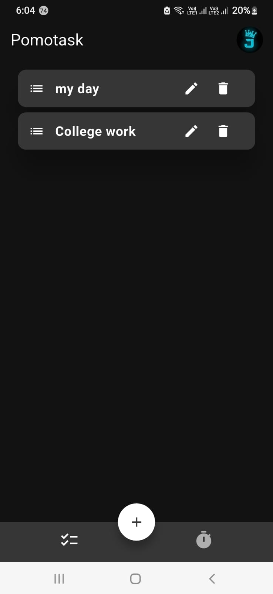
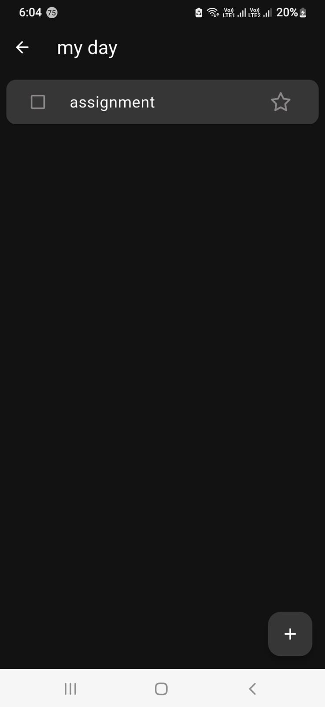
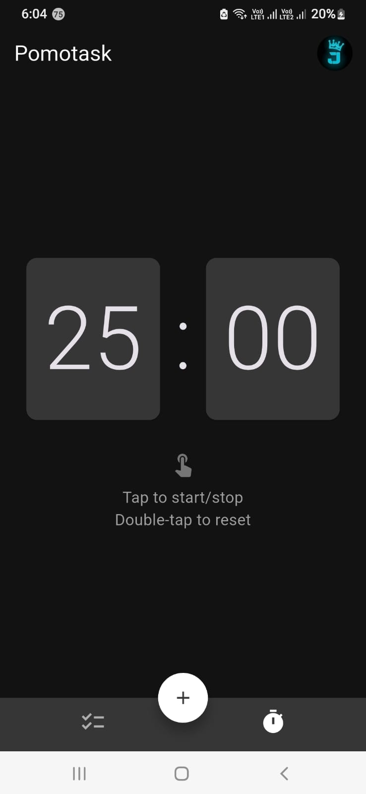
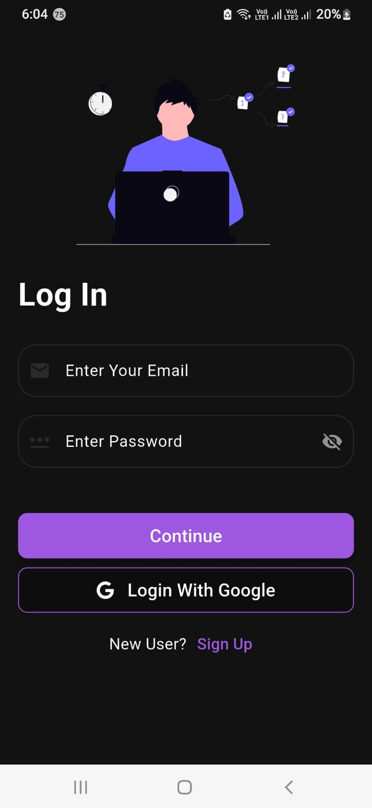
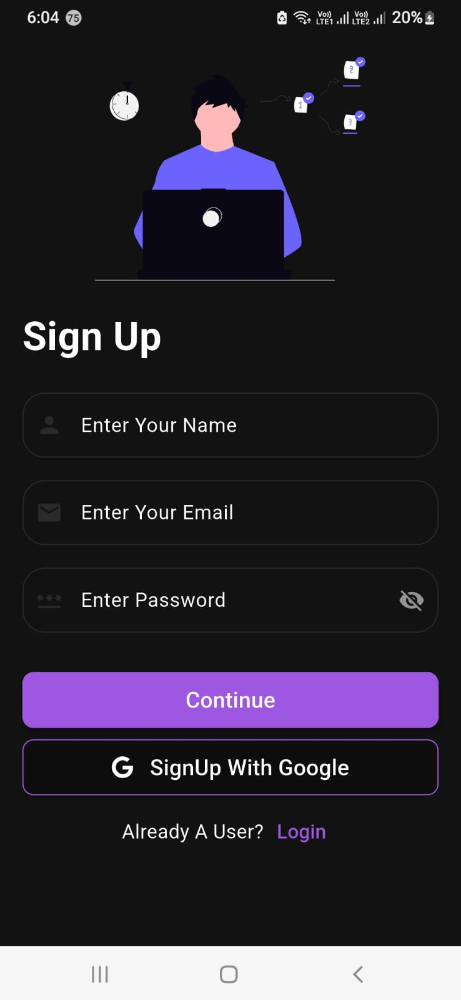

# Pomotask ✔️  
**Pomodoro Timer + Task Manager**  

  
 
  

A minimalist productivity app combining a **Pomodoro timer** and **task manager** with Firebase authentication and cloud storage.  

## Features ✨  
### 🕒 Pomodoro Timer  
- 25-minute focus sessions (default).  
- **Tap** to start/pause, **double-tap** to reset.  
- Vibrates when the timer ends.  

### 📝 Task Management  
- Create **lists of tasks** (e.g., "Work", "Study").  
- Mark tasks as **important** ⭐ or **completed** ✔️.  
- **Swipe to delete** tasks.  
- View all lists on the home screen.  

### 🔐 Authentication  
- Email/password login.  
- **Google Sign-In** integration.  

### ☁️ Backend  
- **Firebase** for real-time data and auth.  
- **Google Cloud Storage** for file backups.  

 
## Screenshots 📱

  
   
  

  
   

## Download APK 📥  
 

### How to Install:  
1. Download the APK file.  
2. Enable "Install unknown sources" in Android settings.  
3. Open the APK and install.  

## Tech Stack  
**Frontend**: Flutter
**Backend**: Firebase Auth, Firestore, Google Cloud  
**Packages**: `firebase_auth`, `cloud_firestore`, `google_sign_in`  

